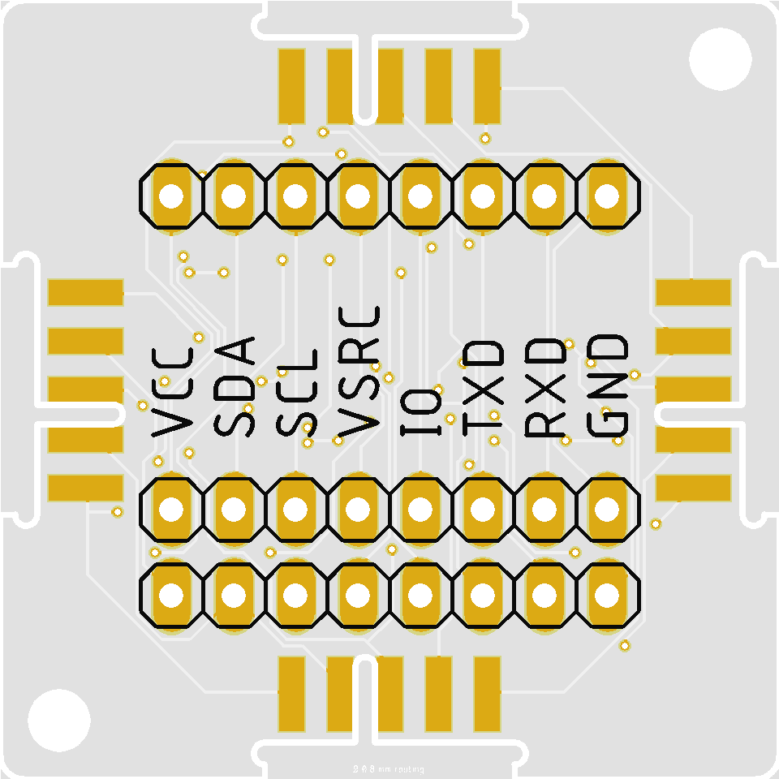
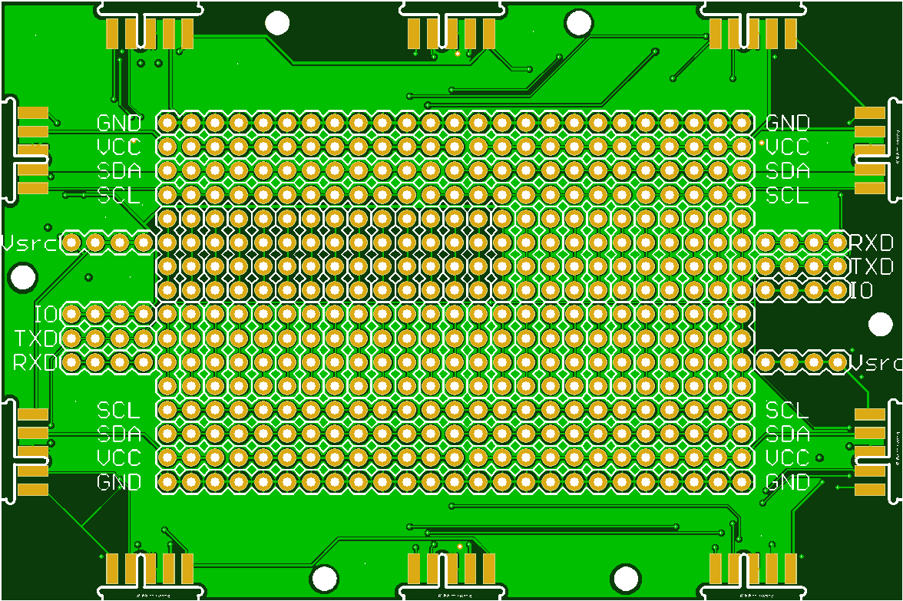
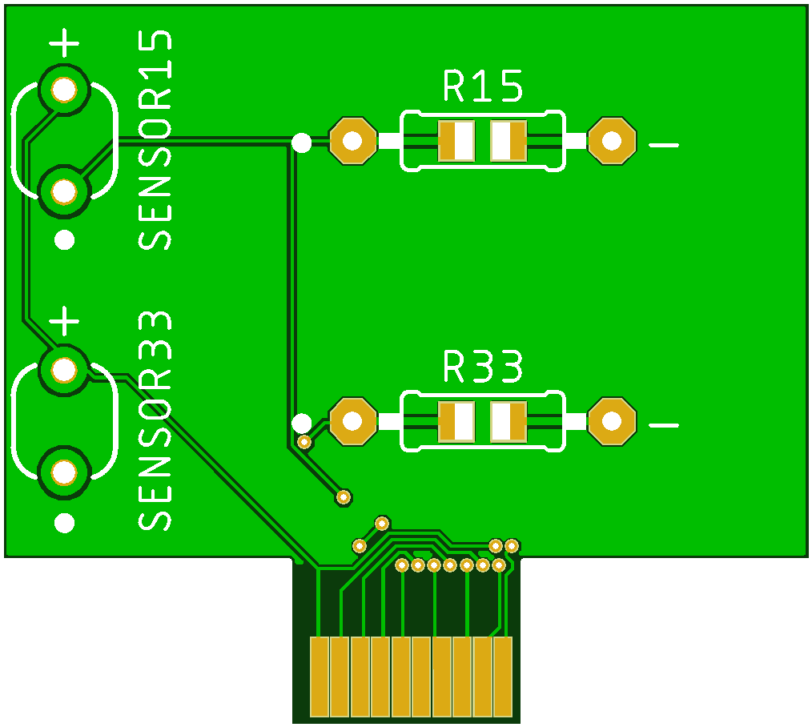
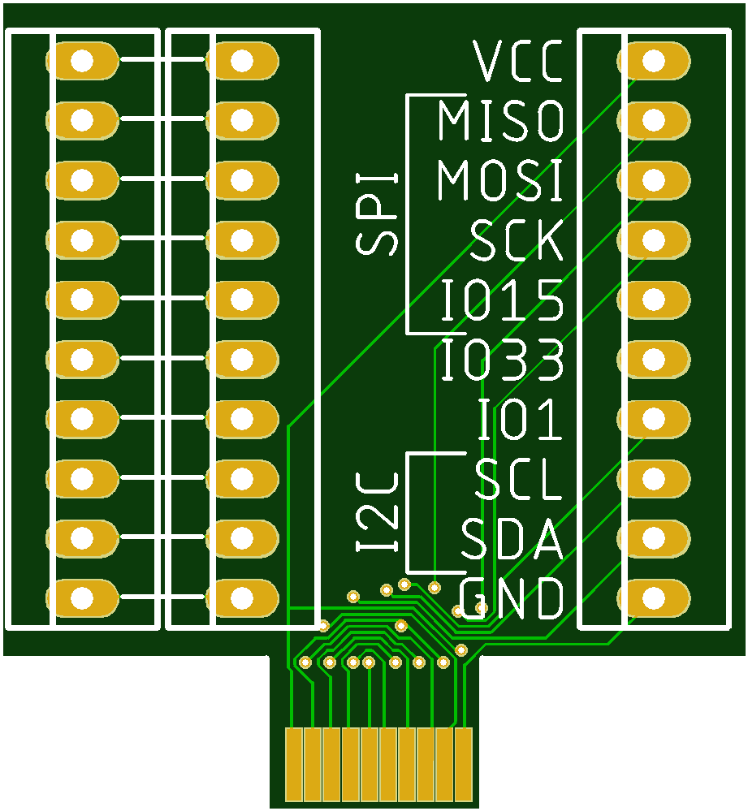

# Prototype Boards

## Boards

| Board | Size | Design | Description |
|--|:--:|:--:|--|
| IPB | 1U |||
| IPP | 2x3U |||
| EPA | EXT || Analog sensor board |
| EPB | EXT || Bus board |

## Size
### Standard Boards
All standard boards are a multiple of 32x32 mm, called 1U (It comes from Lego, where one dot is 8x8mm).
In order to add two boards together, 0.1 mm is subtracted from each side (also a Lego standard).
So a single chip is 31.8x31.8 mm and a large 2x3 chip (2x3U) board is (2x32-0.1-0.1) x (3x32-0.1-0.1) 63.8x95.8mm
All boards are standard 1.6mm thick.
The rest you can deduct from the design.

### Extension boards (EXT)
No specific size requirements, but I try to keep the width within 31.8mm.
> NOTE: The boards are only 1mm thick!!!

## Eagle 
All boards are designed in Eagle, which you can [freely download](https://www.autodesk.com/products/eagle/free-download).

In Eagle there is an ULP, that allows you to make a library from the schematic/layout.

# License: 

Creative Commons Attribution-NonCommercial-ShareAlike 4.0 International Public License

[View License Deed](https://creativecommons.org/licenses/by-nc-sa/4.0/) | [View Legal Code](https://creativecommons.org/licenses/by-nc-sa/4.0/legalcode)
